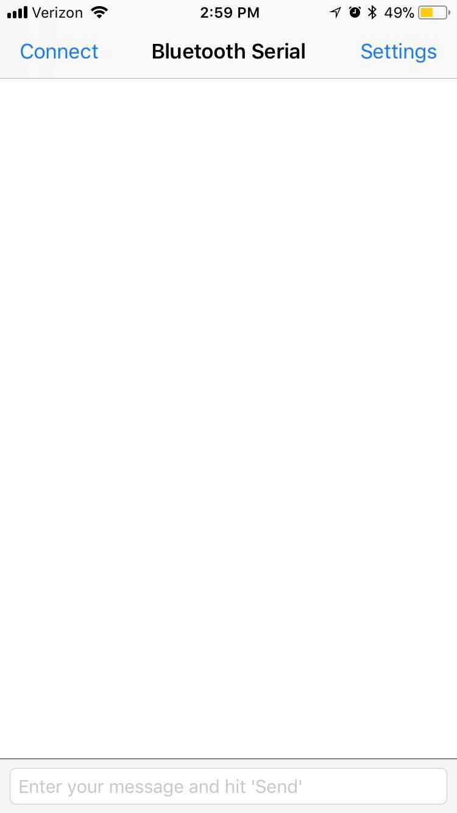

# HM10 Bluetooth Module Communication Application
Simple iOS app that incorporates the Apple Core Bluetooth framework to dynamically visualize data sent over the Arduino Serial Monitor. Created as part of an introductory project for the Duke Acoustofluidics Lab. This was my first experience programming in Swift 4, and it taught me a lot about basic UI in app development.

---
## Application interface 
The image below shows the Main Storyboard of the app:

Users can connect to different modules, or open a settings menu.

---
## Scanning view
Once a user has opted to scan for devices, eligible HM10 devices will appear on the menu to connect to:

---
## Serial monitor reading and scatter plot construction
The following is a display of the `draw` function:

Once drawing is completed, users are also able to tap on data points and view their coordinates:

---
